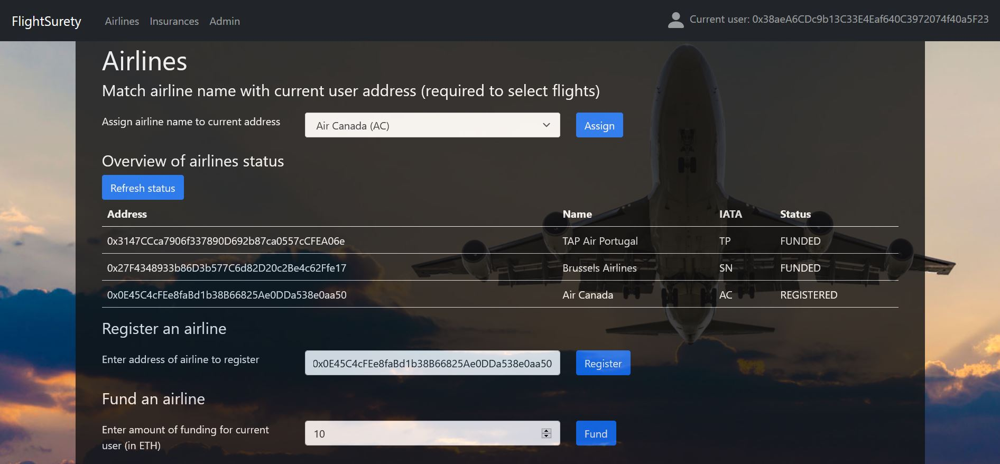
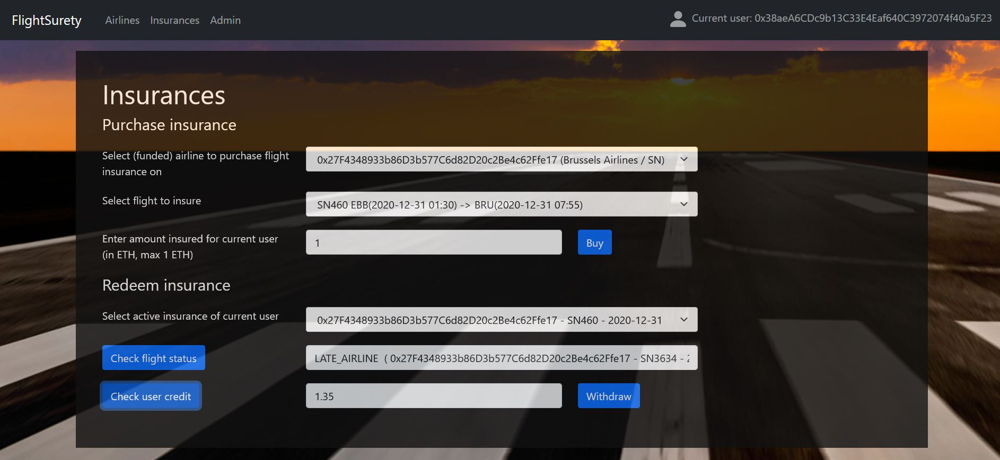

# FlightSurety

FlightSurety is a sample application based on Smart Contracts running on the Ethereum blockchain, that simulates an insurance for flights. A graphical UI running in a web browser allows users to use the application.

This application was developped as part of Udacity's Blockchain Developer Nanodegree Program. It is based on scaffolding code initially provided by Udacity, see https://github.com/udacity/FlightSurety.

## Install

This repository contains Smart Contract code in Solidity (using Truffle), tests (also using Truffle), dApp (using HTML, CSS and JS) and server app.

- To install, download or clone the repo, then:

`npm install`

- Make sure you already have truffle installed:

`npm install -g truffle`

- Launch Ganache with at least 40 accounts.

- Deploy contracts to Ganache.

`truffle migrate --reset`

## Test the smart contracts

To run truffle tests:

`truffle test ./test/flightSurety.js`
`truffle test ./test/oracles.js`

## Start the server

`npm run server`

Wait for the message
>FlightSuretyServer now listening at http://localhost:3000

before starting the dApp

## Start the dApp

`npm run dapp`

## Using the dApp

Go to

`http://localhost:8000`

Key elements for using the dApp:
- The dApp requires Metamask to be installed
- Before starting the dApp, the account selected in Metamask needs to match the first account in Ganache. This account will be assigned to an airline that will be registered (but not funded)
- Flights and airlines' names are fetched from the server. Airlines addresses Ethereum need to be matched by users to airlines names, using the drop down menu. This information is then stored on the server
- Flights to be insured can only be selected for funded airlines, for which the airline address has been matched to an airline name
- Users can request checking the status of any flight they are insured for. Unless the status is UNKNOWN, all passengers that had purchased an insurance for that flight are either credited (if the flight is delayed due to the airline), or their insurance premium is transferred to the insurance. After that, the insurance becomes inactive.

## dApp screenshots

## Resources

* [How does Ethereum work anyway?](https://medium.com/@preethikasireddy/how-does-ethereum-work-anyway-22d1df506369)
* [BIP39 Mnemonic Generator](https://iancoleman.io/bip39/)
* [Truffle Framework](http://truffleframework.com/)
* [Ganache Local Blockchain](http://truffleframework.com/ganache/)
* [Remix Solidity IDE](https://remix.ethereum.org/)
* [Solidity Language Reference](https://docs.soliditylang.org/en/v0.8.0/)
* [Ethereum Blockchain Explorer](https://etherscan.io/)
* [Web3Js Reference](https://github.com/ethereum/wiki/wiki/JavaScript-API)
